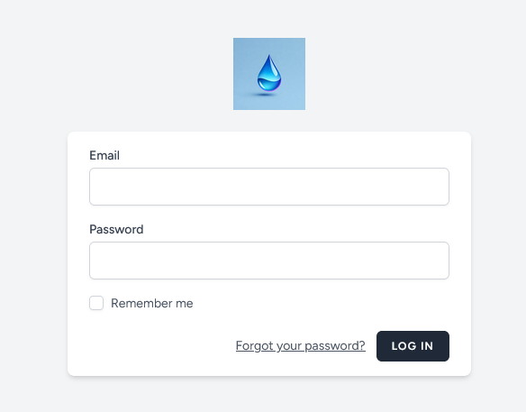
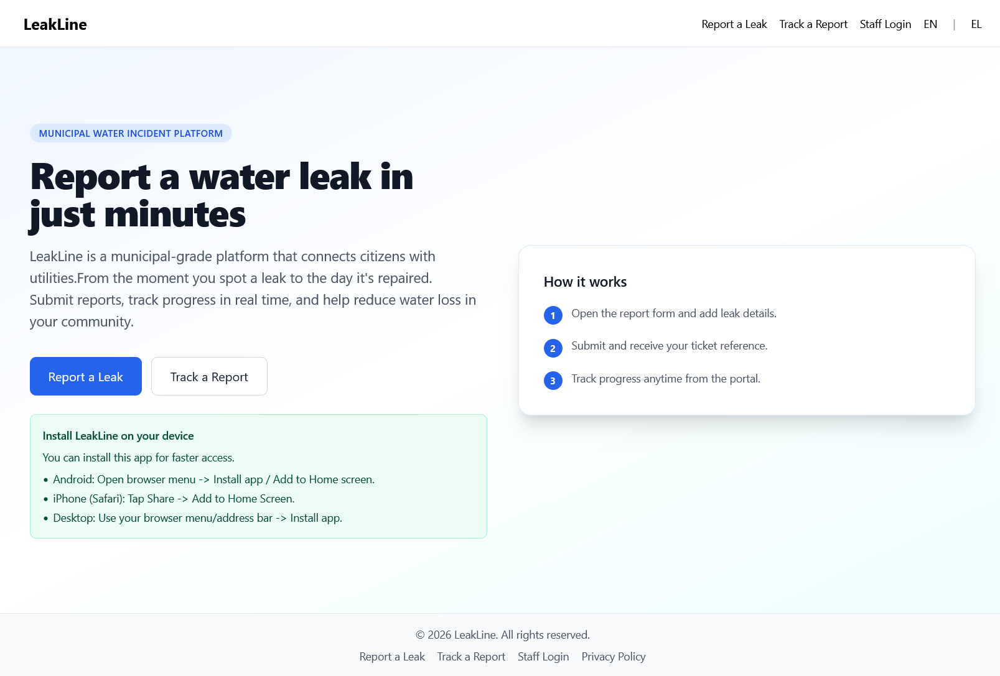
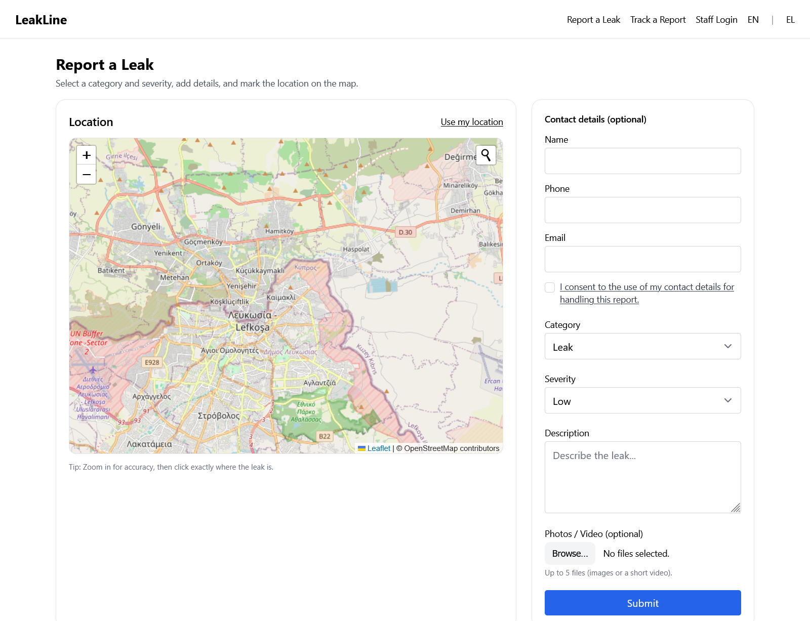
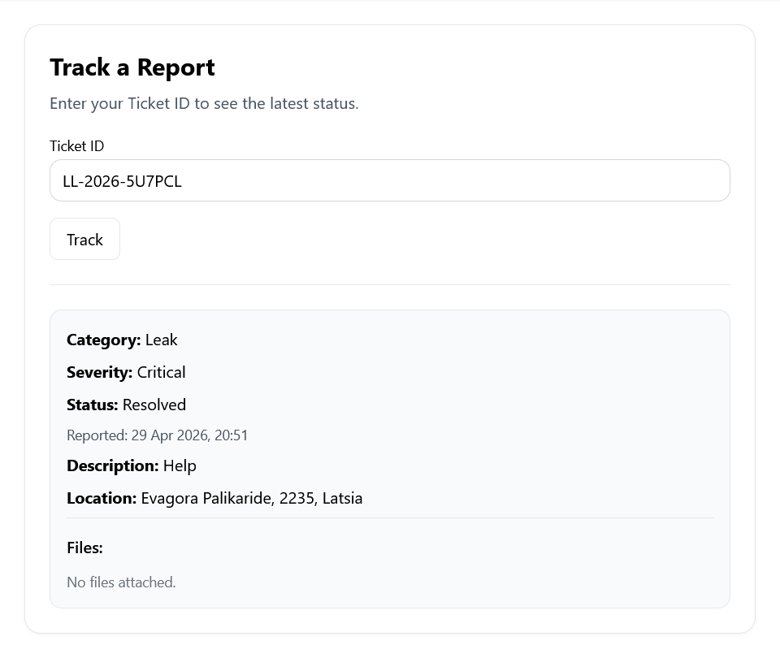
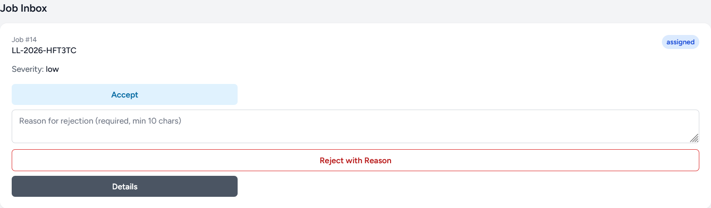
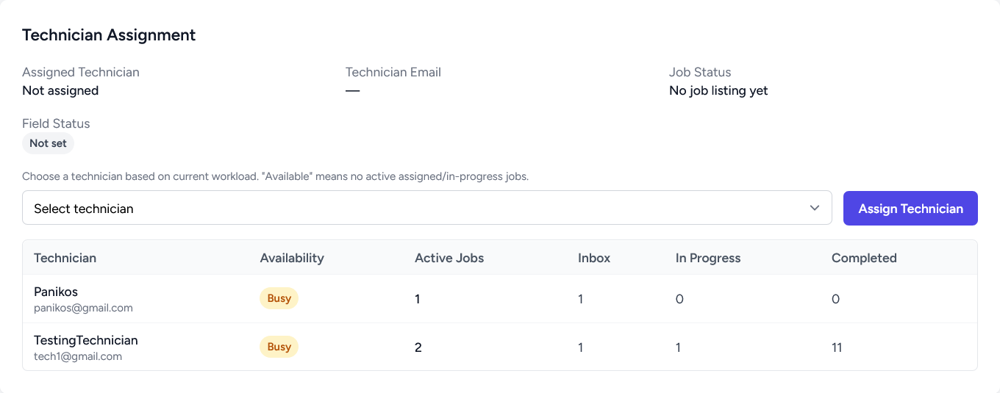
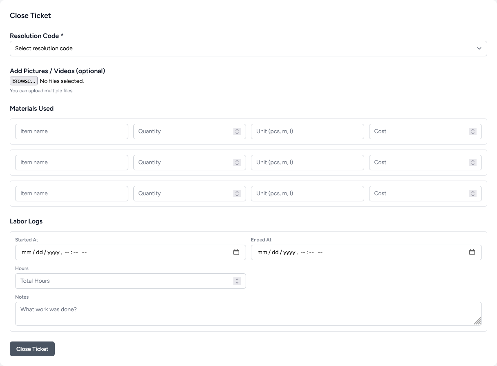
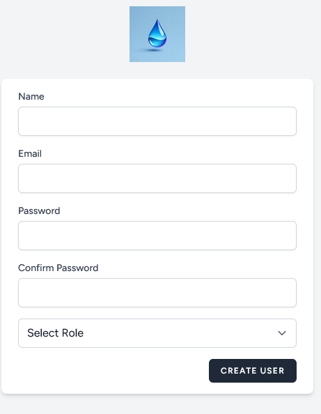
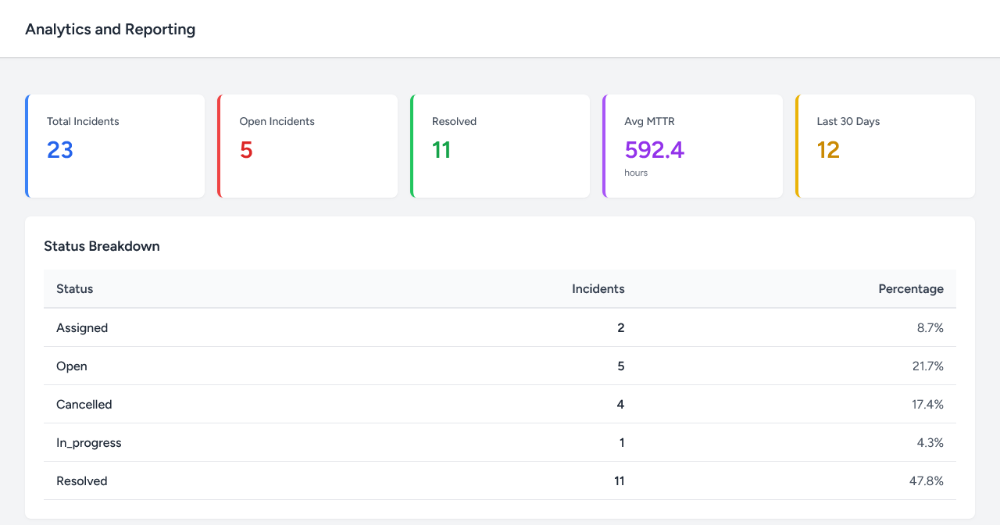

# LeakLine

LeakLine is a web-based water leak management platform developed as my bachelor thesis project using Laravel and PostgreSQL. The platform modernizes the process of reporting, managing, and resolving water leak incidents by providing dedicated interfaces for citizens, coordinators, technicians, and administrators.

## Features

### Citizen Portal

* Submit water leak reports
* Provide location information
* Add contact details
* Track incident status
* PWA capabilities for citizen pages

### Progressive Web Application (PWA)
- Installable application experience
- Mobile-friendly interface
- Service worker support
- Web app manifest configuration
- Improved accessibility from mobile devices

### Coordinator Dashboard

* Review submitted incidents
* Filter incidents by status and severity
* Assign technicians
* Monitor ongoing repairs
* Analytics and Reporting with export

### Technician Dashboard

* View assigned jobs
* Update work progress
* Complete repairs
* Record resolution details
* Navigation to incident

### Administration

* Create new staff users
* Update user information
* Assign roles to users

### Reporting & Analytics

* Incident statistics
* Resolution metrics
* Mean Time To Repair (MTTR)
* Export as PDF

## Technologies Used

* PHP 8
* Laravel 12
* Blade
* PostgreSQL
* JavaScript
* HTML/CSS
* Tailwind CSS
* OSM/Leaflet 
* Git & GitHub
* Docker 
  
## Architecture

The system follows the MVC (Model-View-Controller) architecture provided by Laravel.

Key components include:

* Authentication & Authorization
* Role-Based Access Control
* Incident Management Workflow
* Dashboard & Analytics Module
* Relational Database Design

## Future Improvements

* Push notifications
* Offline incident reporting synchronization
* Public REST API
* Enhanced GIS analytics

## Screenshots

### Sign In

### Citizen Homepage

### Report a Leak

### Track Incident Status

### Coordinator Dashboard

### Technician Job Inbox

### Technician Assignment

### Close Job

### Staff Creation

### Analytics & Reporting

## Author

George Karapatakis
Bachelor Thesis Project
